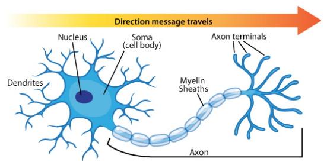
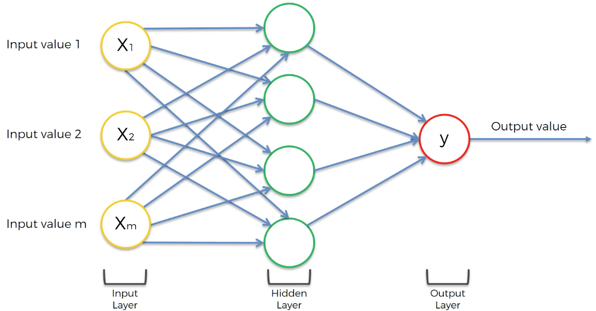
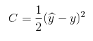
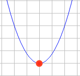

# Will the customer leave the bank?

**Task: Customer behaviour predictions**

We are currently working within the data science team of a bank. We have been tasked to produce a machine learning model that predicts whether a customer will leave or stay with the bank, depending on some independent variables. 

We will be using an "Artificial Neural Network" to complete this business task.

## Artificial Neural Networks

An Artificial Neural Network (ANN) is a "Deep Learning" model that can be used for regression and classification. We create an artificial structure where we have nodes that represent neurons. The image below shows a neuron.



Neurons by themselves are not of much use but when you have many neurons together, they work together to produce magic. The digram below shows an ANN with one hidden layer.



Each neuron independently in the hidden layer will not be able to predict the outcome y. However, combining them together will enable us to produce the output layer (output value y). If trained properly, they will do an accurate job.
The neurons in the hidden layer will pick up different combinations of input values (independent variables) and different weights. They will work together to produce the final output y.

**Cost function**

The error in our prediction can be evaluated using the cost function; our goal is to minimise the cost function. The cost function is given below.



The cost function value C gets fed back into the neural network and the corresponding weights are updated. This process is called "Backwards Propagation". The cost function illustrated by the parabola below, seeks the minimum value of the cost function which is the global minimum.



**Back propagation**

An advanced algorithm which allows us to adjust all the weights at the same time. We can do this as the algorithm knows which part of the error each of the weights in the neural network is responsible for.

**Stochastic Gradient Descent**

In batch gradient descent we adjust the weights after we have run all the rows in our neural network. In the stochastic gradient descent  method, we run each row at a time and adjust the weights each time. This helps us avoid the problem of local minimums as the fluctuations are larger as we're running the method per line each time. This method is faster as it is a lighter algorithm as we do not load all the data at once into the memory and then run the data. The advantage of batch gradient descent is that it is a deterministic algorithm rather than a random algorithm. 

The mini batch gradient descent method is midway between the two, where random batches of rows are run.

**Steps in training the ANN with Stochastic Gradient Descent**

- **Step 1:** Randomly initialise the weights to small numbers that are close to 0 (but not 0).
- **Step 2:** Input the first observation of your dataset into the input layer, each feature into one input node.
- **Step 3:** Forward-Propagation: From left to right, the neurons are activated in a way that the impact of each neuron's activation is limited by the weights. Propagate the activations until getting the predicted result y.
- **Step 4:** Compare the predicted result to the actual result; measure the generated error.
- **Step 5:** Back-Propagation: From right to left, the error is back-propagated. Update the weights according to how much they're responsible for the error. The learning rate decides by how much we update the weights. 
- **Step 6:** Repeat steps 1 to 5 and update the weights after each observation, or repeat steps 1 to 5 but update the weights only after a batch of observations.
- **Step 7:** When the whole training set has passed through the ANN, that makes an epoch. We decide how many epochs to perform.

In the below code, we have selected 10 observations per epoch and this to be repeated 100 times (epochs = 100).

```
classifier.fit(X_train, y_train, batch_size = 10, epochs = 100)
```

The code below shows the output as the epochs are running. As the epochs run, we observe the accuracy increasing and loss decreasing.

```
Epoch 1/100
8000/8000 [==============================] - 1s 179us/step - loss: 0.4801 - accuracy: 0.7960
Epoch 2/100
8000/8000 [==============================] - 1s 149us/step - loss: 0.4252 - accuracy: 0.7960

...

Epoch 99/100
8000/8000 [==============================] - 1s 153us/step - loss: 0.4007 - accuracy: 0.8354
Epoch 100/100
8000/8000 [==============================] - 1s 152us/step - loss: 0.4008 - accuracy: 0.8356
```
### References

Neuron diagram:  https://askabiologist.asu.edu/neuron-anatomy

ANN digram: https://www.udemy.com/course/machinelearning/

Online latex editor: https://www.codecogs.com/latex/eqneditor.php

Online graph plotter: https://rechneronline.de/function-graphs/
